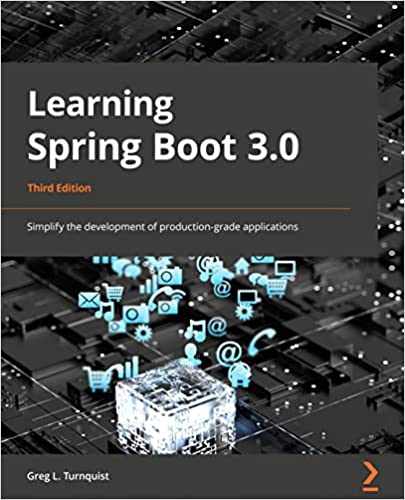

== Learning Spring Boot 3.0: 3rd Edition (Packt)

*Spring Boot 3* is the hottest ticket in town when it comes to building Java apps. In this book, you’ll learn how to leverage powerful databases and Spring Boot's highly adopted Spring MVC web technology. This practical guide will help you get up and running with all the latest features of Spring Boot 3.

The book starts by helping you build a simple app and then shows you how to secure, test, bundle and deploy it to production. Next, you’ll focus on the ability to go ‘native’ and release your app on GraalVM. Later chapters cover reactive programming and explore scalable web controllers and data operations. You’ll gain in-depth insights into developer tools, security, and deployment. In addition to this, you’ll learn how to secure your application using both routes and method-based rules.

By the end of this book, you’ll be able to apply what you’ve learned to any Spring Boot related problem.

https://springbootlearning.com/book[Grab your copy today] and learn to simplify the development of production-grade applications!

https://springbootlearning.com/book[]

*Greg L. Turnquist* is a test-bitten script junky and a member of the Spring team at VMware. He wrote technical best sellers _Hacking with Spring Boot 2.4: Classic Edition_, _Hacking with Spring Boot 2.3: Reactive Edition_, _Learning Spring Boot 2.0 2nd Edition_ and _Python Testing Cookbook_. He also launched the YouTube channel, https://www.youtube.com/SpringBootLearning[Spring Boot Learning], where you learn about Spring Boot and have fun doing it!

Follow him on Twitter https://twitter.com/springbootlearn[@springbootlearn] and subscribe for all his Spring Boot videos at https://www.youtube.com/SpringBootLearning[YouTube.com/SpringBootLearning].

== Code for the book

This is a standing repo of the code for _Learning Spring Boot 3.0: 3rd Edition_ published by Packt.

CAUTION: No have Java? I suggest you download and install https://sdkman.io/[sdkman] and use it to install your favorite version of Java 17!

Stay tuned. In the meantime, http://www.urbandictionary.com/define.php?term=share%20and%20enjoy[share and enjoy]!

== Licensing

The code in this project is MIT licensed (see LICENSE file) and copyrighted by Packt Publishing.
